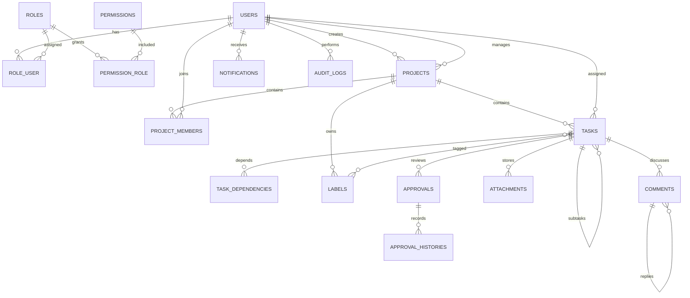

# Database and ERD

Important indexes cover project status/deadline/manager, membership uniqueness, task project/assignee/status/priority/deadline/parent/order, dependency uniqueness, comments and attachments by task, and audit entity/action/time queries. Project progress is computed with aggregate counts instead of loading task rows into JavaScript.
